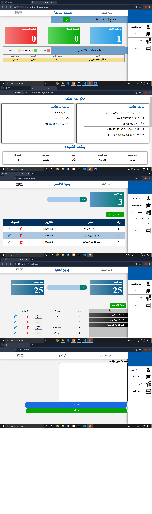

This is web And Api

<a href="https://github.com/Mustafa-Alarify-GitHub/Project-Flutter-UniverCity-LABYA-">
repo the app mobile
</a>

I use for images
 
<a href="https://storyset.com/people">People illustrations by Storyset</a> 
 
<a href="https://www.flaticon.com/free-icons/business-idea" title="business idea icons">Business idea icons created by Freepik - Flaticon</a>